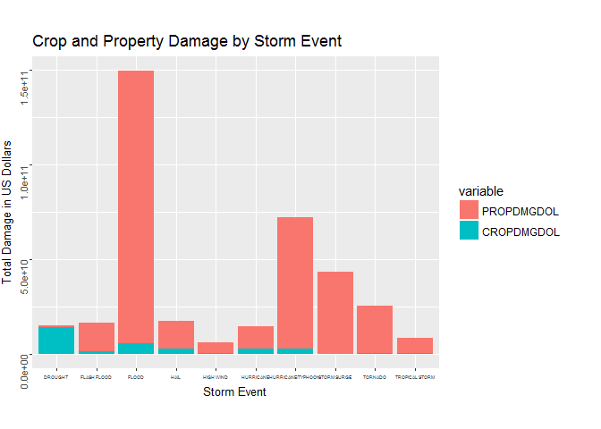
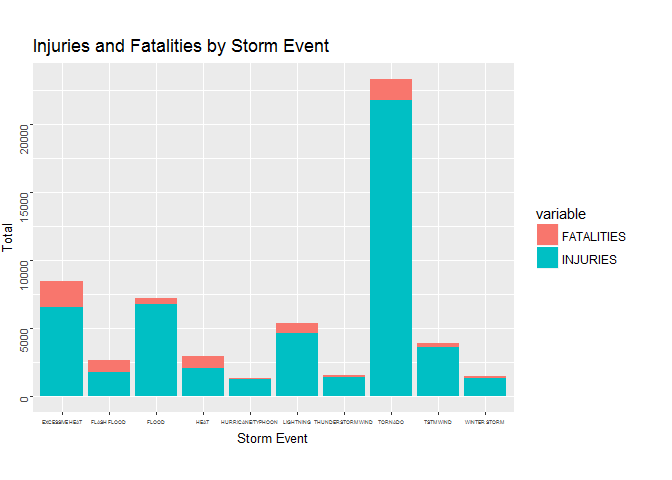

Types of weather events causing the Health and Economic Problems in US
----------------------------------------------------------------------

===================================================================================================

Synopsis
--------

This analysis is about what type of the weather events were the most
harmful to both public health and economic aspects in the United States.

The base data is the U.S. National Oceanic and Atmospheric
Administration's (NOAA) storm database. This database tracks
characteristics of major storms and weather events in the United States,
including when and where they occur, as well as estimates of any
fatalities, injuries, and property damage.

As the results of the analysis,tornadoes are the most harmful to public
health and haricanes are the most harmful to the economy.

Basic Setting
-------------

    echo = TRUE  
    library(ggplot2)
    library(plyr)
    library(reshape2)
    library(knitr)

    sessionInfo()

    ## R version 3.3.2 (2016-10-31)
    ## Platform: x86_64-w64-mingw32/x64 (64-bit)
    ## Running under: Windows 10 x64 (build 14393)
    ## 
    ## locale:
    ## [1] LC_COLLATE=Japanese_Japan.932  LC_CTYPE=Japanese_Japan.932   
    ## [3] LC_MONETARY=Japanese_Japan.932 LC_NUMERIC=C                  
    ## [5] LC_TIME=Japanese_Japan.932    
    ## 
    ## attached base packages:
    ## [1] stats     graphics  grDevices utils     datasets  methods   base     
    ## 
    ## other attached packages:
    ## [1] knitr_1.15.1   reshape2_1.4.2 plyr_1.8.4     ggplot2_2.2.0 
    ## 
    ## loaded via a namespace (and not attached):
    ##  [1] Rcpp_0.12.6      assertthat_0.1   digest_0.6.10    rprojroot_1.1   
    ##  [5] grid_3.3.2       gtable_0.2.0     backports_1.0.4  magrittr_1.5    
    ##  [9] evaluate_0.10    scales_0.4.1     stringi_1.1.1    lazyeval_0.2.0  
    ## [13] rmarkdown_1.2    tools_3.3.2      stringr_1.1.0    munsell_0.4.3   
    ## [17] yaml_2.1.13      colorspace_1.3-1 htmltools_0.3.5  tibble_1.1

Getting and Loading the Data
----------------------------

Down load the raw data from URL

    setwd("C:/Users/Tachibana/Documents/GitHub/RepData_PeerAssessment2") # Set wd
    url <- "http://d396qusza40orc.cloudfront.net/repdata%2Fdata%2FStormData.csv.bz2"
    destfile <- "stormData.csv.bz2"
    download.file(url, destfile)

Read the data as Data Frame

    Data <- read.csv(bzfile("stormData.csv.bz2"), strip.white = TRUE)

check the loaded data

    dim(Data)

    ## [1] 902297     37

    head(Data)

    ##   STATE__           BGN_DATE BGN_TIME TIME_ZONE COUNTY COUNTYNAME STATE
    ## 1       1  4/18/1950 0:00:00     0130       CST     97     MOBILE    AL
    ## 2       1  4/18/1950 0:00:00     0145       CST      3    BALDWIN    AL
    ## 3       1  2/20/1951 0:00:00     1600       CST     57    FAYETTE    AL
    ## 4       1   6/8/1951 0:00:00     0900       CST     89    MADISON    AL
    ## 5       1 11/15/1951 0:00:00     1500       CST     43    CULLMAN    AL
    ## 6       1 11/15/1951 0:00:00     2000       CST     77 LAUDERDALE    AL
    ##    EVTYPE BGN_RANGE BGN_AZI BGN_LOCATI END_DATE END_TIME COUNTY_END
    ## 1 TORNADO         0                                               0
    ## 2 TORNADO         0                                               0
    ## 3 TORNADO         0                                               0
    ## 4 TORNADO         0                                               0
    ## 5 TORNADO         0                                               0
    ## 6 TORNADO         0                                               0
    ##   COUNTYENDN END_RANGE END_AZI END_LOCATI LENGTH WIDTH F MAG FATALITIES
    ## 1         NA         0                      14.0   100 3   0          0
    ## 2         NA         0                       2.0   150 2   0          0
    ## 3         NA         0                       0.1   123 2   0          0
    ## 4         NA         0                       0.0   100 2   0          0
    ## 5         NA         0                       0.0   150 2   0          0
    ## 6         NA         0                       1.5   177 2   0          0
    ##   INJURIES PROPDMG PROPDMGEXP CROPDMG CROPDMGEXP WFO STATEOFFIC ZONENAMES
    ## 1       15    25.0          K       0                                    
    ## 2        0     2.5          K       0                                    
    ## 3        2    25.0          K       0                                    
    ## 4        2     2.5          K       0                                    
    ## 5        2     2.5          K       0                                    
    ## 6        6     2.5          K       0                                    
    ##   LATITUDE LONGITUDE LATITUDE_E LONGITUDE_ REMARKS REFNUM
    ## 1     3040      8812       3051       8806              1
    ## 2     3042      8755          0          0              2
    ## 3     3340      8742          0          0              3
    ## 4     3458      8626          0          0              4
    ## 5     3412      8642          0          0              5
    ## 6     3450      8748          0          0              6

Data Processing
---------------

The events in the database start in the year 1950 and end in November
2011. In the earlier years of the database there are generally fewer
events recorded, most likely due to a lack of good records. More recent
years should be considered more complete.

So we would see the event numbers by the year.

    Data$year <- as.numeric(format(as.Date(Data$BGN_DATE, format = "%m/%d/%Y %H:%M:%S"), "%Y"))
    table(Data$year)

    ## 
    ##  1950  1951  1952  1953  1954  1955  1956  1957  1958  1959  1960  1961 
    ##   223   269   272   492   609  1413  1703  2184  2213  1813  1945  2246 
    ##  1962  1963  1964  1965  1966  1967  1968  1969  1970  1971  1972  1973 
    ##  2389  1968  2348  2855  2388  2688  3312  2926  3215  3471  2168  4463 
    ##  1974  1975  1976  1977  1978  1979  1980  1981  1982  1983  1984  1985 
    ##  5386  4975  3768  3728  3657  4279  6146  4517  7132  8322  7335  7979 
    ##  1986  1987  1988  1989  1990  1991  1992  1993  1994  1995  1996  1997 
    ##  8726  7367  7257 10410 10946 12522 13534 12607 20631 27970 32270 28680 
    ##  1998  1999  2000  2001  2002  2003  2004  2005  2006  2007  2008  2009 
    ## 38128 31289 34471 34962 36293 39752 39363 39184 44034 43289 55663 45817 
    ##  2010  2011 
    ## 48161 62174

The table shows that the event numbers increased from 1995. So we only
use the data from 1995 and after then. Subset data from 1995.

    Data$BGN_DATE <- as.Date(Data$BGN_DATE, format = "%m/%d/%Y")
    sData <- subset(Data, Data$BGN_DATE > as.Date("1994-12-31"))

Compute economic damage amounts
-------------------------------

The data provided one column indicating the amount and another
indicating the unit: "K" for thousands,"M" for millions, or "B" for
billions. I needed to combine these two columns into a single column
representing the total cost dollars for each observation.

    modified_Data <- function(x){
            x <- as.character(x)
            ifelse (x == "B", as.numeric(1000000000),
            ifelse(x == "M", as.numeric(1000000), 
            ifelse(x == "K", as.numeric(1000), 0)))
    }
    sData$PROPDMGEXP <- toupper(sData$PROPDMGEXP)
    sData$PROPDMGEXP <- modified_Data(sData$PROPDMGEXP)

The damage amount of Property Damage is PROPDMG \* PROPDMGEXP.

    sData$PROPDMGDOL <- as.numeric(sData$PROPDMG*sData$PROPDMGEXP)

Then we did the same for Crop damage, creating a new variable CROPDMGDOL
that became the total amount of crop damage in US Dollars.

    sData$CROPDMGEXP <- toupper(sData$CROPDMGEXP)
    sData$CROPDMGEXP <- modified_Data(sData$CROPDMGEXP)
    sData$CROPDMGDOL <- as.numeric(sData$CROPDMG*sData$CROPDMGEXP)

Combine Property damage and Crop damage to get Total economic dammage
amount.

    sData$TOTALDMGDOL <- sData$CROPDMGDOL + sData$PROPDMGDOL

Compute the economic loss by event type
---------------------------------------

    prop <- aggregate(PROPDMGDOL ~ EVTYPE,sData, sum)
    crop <- aggregate(CROPDMGDOL ~ EVTYPE,sData, sum)
    total <- aggregate(TOTALDMGDOL ~ EVTYPE,sData, sum)

We aggregate the total damage in US Dollars by event type for property
damage, crop damage and total damage. These are all combined into a new
data frame. The top 10 events with the highest amount of total damage
were subsetted and plotted.

    storm_econ<- join_all(list(prop, crop, total), by = "EVTYPE")
    storm_econ <- storm_econ[order(-storm_econ$TOTALDMGDOL),][1:10,]
    storm_econ<- melt(storm_econ, id=c("EVTYPE"), measure.vars=c("PROPDMGDOL","CROPDMGDOL"))
    storm_econ$EVTYPE <- as.factor(storm_econ$EVTYPE)
    ggplot(data=storm_econ, aes(EVTYPE, value, fill =variable)) + geom_bar(stat="identity")+xlab("Storm Event") + ylab("Total Damage in US Dollars") + ggtitle("Crop and Property Damage by Storm Event")+theme(axis.title.x=element_text(vjust=-2)) +theme(plot.margin = unit(c(1,1,1,0), "cm"))+theme(axis.title.x = element_text(size=10),axis.title.y = element_text(size=10))+ theme(axis.text.x = element_text(size=4),axis.text.y = element_text(size=8,angle=90)) 

As a result,haricanes are the most harmful to the economic view point.

Compute health damage amounts
-----------------------------

To determine which types of events (as indicated in the EVTYPE variable)
are most harmful with respect to population health, We aggregate the
total amount of injuries and fatalities by event type. Then we create a
new variable TOTAL that combined the total amount of injuries and
fatalities. The 10 events with the highest amount of total injuries and
fatalities were subsetted and plotted.

    fatalities <- aggregate(FATALITIES ~ EVTYPE,sData, sum)
    injuries <- aggregate(INJURIES ~ EVTYPE,sData, sum)

    storm_health <- join_all(list(fatalities, injuries), by = "EVTYPE")
    storm_health$TOTAL <- storm_health$FATALITIES + storm_health$INJURIES
    storm_health <- storm_health[order(-storm_health$TOTAL),][1:10,]
    storm_health <- melt(storm_health, id=c("EVTYPE"), measure.vars=c("FATALITIES","INJURIES"))
    storm_health$EVTYPE <- as.factor(storm_health$EVTYPE)
    ggplot(data=storm_health, aes(EVTYPE, value, fill =variable)) + geom_bar(stat="identity")+xlab("Storm Event") + ylab("Total") + ggtitle("Injuries and Fatalities by Storm Event")+theme(axis.title.x=element_text(vjust=-2)) +theme(plot.margin = unit(c(1,1,1,0), "cm"))+theme(axis.title.x = element_text(size=10),axis.title.y = element_text(size=10))+ theme(axis.text.x = element_text(size=4),axis.text.y = element_text(size=8,angle=90)) 

As the result of the analysis,tornades are the most harmful to public
health.

Conclusion
----------

As the analysis shows, haricanes are the most harmful event to economic
view points and tornades are the most harmful event to public health.
